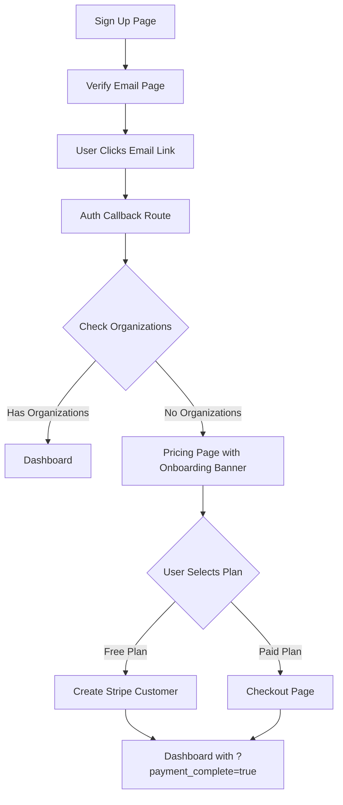

# First-Time User Onboarding Flow - Implementation Summary

## Problem Statement

The original flow for new users was broken:

**Old Flow (Broken):**
```
Sign up → Verify Email Page → User clicks email link → 
Login Page (forced by middleware) → Dashboard (wrong!)
```

**Desired Flow:**
```
Sign up → Verify Email Page → User clicks email link → 
Pricing Page → Stripe Payment → Dashboard
```

### Root Causes Identified

1. **Email verification created a session but discarded it** - The callback redirected to `/email-verified` which didn't utilize the session
2. **Middleware race condition** - Middleware redirected authenticated users away from `/login` to `/` before the login page could execute its pricing redirect
3. **No organization status check in routing** - System didn't distinguish between first-time users (no organizations) and returning users (with organizations)

---

## Solution Implemented

### 1. Enhanced Auth Callback Route (`app/auth/callback/route.ts`)

**Key Changes:**
- Now checks if user has organizations after email verification
- Keeps the session active (no more forced re-login)
- Routes intelligently:
  - **First-time users (no orgs)** → `/pricing?onboarding=true`
  - **Returning users (has orgs)** → `/` (dashboard)

**Flow:**
```typescript
User verifies email → 
exchangeCodeForSession (creates session) → 
Check organization_members table → 
Redirect based on organization status
```

### 2. Improved Middleware Logic (`middleware.ts`)

**Key Changes:**
- Added organization status check for authenticated users
- Prevents forceful redirects that break the onboarding flow
- Allows first-time users to be routed to pricing

**New Logic:**
```typescript
if (user && trying to access /login or /signup) {
  if (hasOrganizations) {
    redirect to dashboard
  } else {
    redirect to /pricing?onboarding=true  // First-time user
  }
}
```

### 3. Updated Login Page (`app/login/page.tsx`)

**Key Changes:**
- Updated both redirect locations (useEffect and post-login)
- Added `?onboarding=true` parameter for first-time users
- Simplified logic since middleware now handles the heavy lifting

### 4. Smart Email Verified Page (`app/email-verified/page.tsx`)

**Key Changes:**
- Now checks authentication status on page load
- Auto-redirects authenticated users (they shouldn't need to manually click login)
- Shows loading state while checking auth
- Routes based on organization status:
  - **Has organizations** → Dashboard
  - **No organizations** → Pricing (onboarding)

**User Experience:**
```
User clicks email link → 
Email Verified page loads → 
Checks auth status → 
Auto-redirects in ~1 second
```

### 5. Enhanced Pricing Page (`app/pricing/page.tsx`)

**Key Changes:**
- Detects `?onboarding=true` parameter
- Shows welcoming banner for first-time users
- Tailored messaging for onboarding vs regular pricing view

**Onboarding Banner:**
```
🎉 Welcome to Javelina!
Your email has been verified. Choose a plan below to start managing your DNS infrastructure.
```

---

## New User Flow (Fixed)

### Flow Diagram



### Detailed Flow Steps

1. **User signs up** (`/signup`)
   - Enters email, password, name
   - Supabase sends verification email
   - User sees success message

2. **User clicks verification link in email**
   - Link goes to `/auth/callback?code=...`
   - Callback exchanges code for session (user is now logged in!)
   - Callback checks `organization_members` table

3. **First-time user routing** (no organizations)
   - Callback redirects to `/pricing?onboarding=true`
   - Pricing page shows welcome banner
   - User sees tailored onboarding message

4. **User selects a plan**
   - Free plan: Creates Stripe customer → Dashboard
   - Paid plan: Goes to checkout → Stripe payment → Dashboard
   - Enterprise: Shows contact sales message

5. **User completes onboarding**
   - Redirected to dashboard with `?payment_complete=true`
   - Can now create organizations and start using the platform

### Returning User Flow

If a user who already has organizations tries to verify email or login:

```
Auth Callback/Login → 
Check organizations → 
Has organizations → 
Dashboard ✅
```

---

## Technical Details

### Organization Status Check

All routing decisions are based on this query:

```typescript
const { data: memberships } = await supabase
  .from('organization_members')
  .select('organization_id')
  .eq('user_id', user.id)
  .limit(1)

const hasOrganizations = memberships && memberships.length > 0
```

### Parameter Convention

- `?onboarding=true` - Indicates first-time user going through onboarding
- `?payment_complete=true` - Indicates user just completed payment/plan selection

### Session Management

- Email verification creates a valid session immediately
- No forced re-login required
- Session persists across redirects
- Middleware respects the session throughout the flow

---

## Benefits of This Approach

1. **Frictionless Experience** - User never has to manually log in after email verification
2. **Intelligent Routing** - System knows if user is new or returning
3. **Clear Onboarding** - First-time users see welcoming, tailored messaging
4. **No Race Conditions** - Middleware and callback work together harmoniously
5. **Maintains Security** - Still enforces authentication on protected routes

---

## Testing Checklist

### New User Flow
- [ ] Sign up with new email
- [ ] Receive verification email
- [ ] Click verification link
- [ ] Verify redirect to pricing page with onboarding banner
- [ ] Select free plan
- [ ] Verify redirect to dashboard

### Returning User Flow
- [ ] Login with existing account that has organizations
- [ ] Verify redirect to dashboard (not pricing)
- [ ] Try accessing `/login` while authenticated
- [ ] Verify redirect to dashboard (not stuck on login)

### Edge Cases
- [ ] Close verification tab without clicking continue
- [ ] Manually navigate to `/pricing` as authenticated user
- [ ] Try to access dashboard without selecting a plan
- [ ] OAuth login (Google/GitHub) for first-time user

---

## Files Modified

1. `app/auth/callback/route.ts` - Added organization check and smart routing
2. `middleware.ts` - Added organization-aware authentication logic
3. `app/login/page.tsx` - Updated redirect logic with onboarding parameter
4. `app/email-verified/page.tsx` - Added auto-redirect and auth status check
5. `app/pricing/page.tsx` - Added onboarding banner and tailored messaging

---

## Future Enhancements

### Potential Improvements
1. Add progress indicators for multi-step onboarding
2. Store onboarding completion timestamp in user profile
3. Show onboarding checklist on first dashboard visit
4. Add analytics tracking for onboarding conversion rates
5. A/B test different onboarding messages

### Organization Creation
Consider creating a default organization automatically:
- When user selects free plan, auto-create "My Organization"
- Skip pricing page entirely for free users
- Go straight to dashboard with first organization ready

---

## Rollback Instructions

If needed, revert these commits to restore the previous behavior:

```bash
git log --oneline -5
git revert <commit-hash>
```

Or restore specific files:
```bash
git checkout origin/main -- app/auth/callback/route.ts
git checkout origin/main -- middleware.ts
git checkout origin/main -- app/login/page.tsx
git checkout origin/main -- app/email-verified/page.tsx
git checkout origin/main -- app/pricing/page.tsx
```

---

**Implementation Date:** October 24, 2025  
**Status:** ✅ Complete  
**Tested:** Pending user verification

